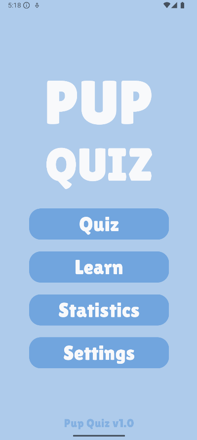
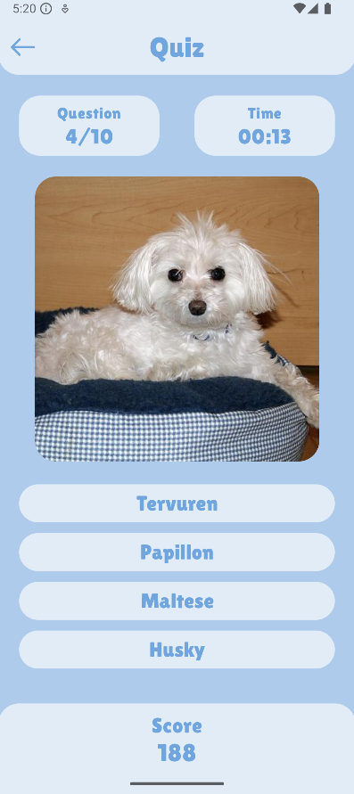
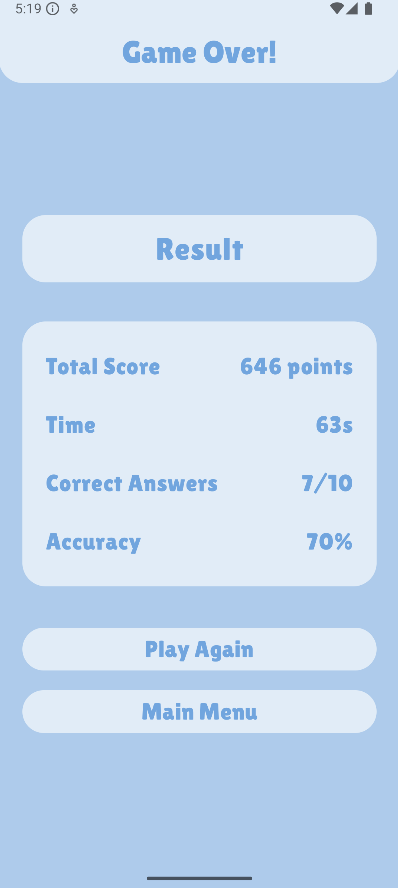
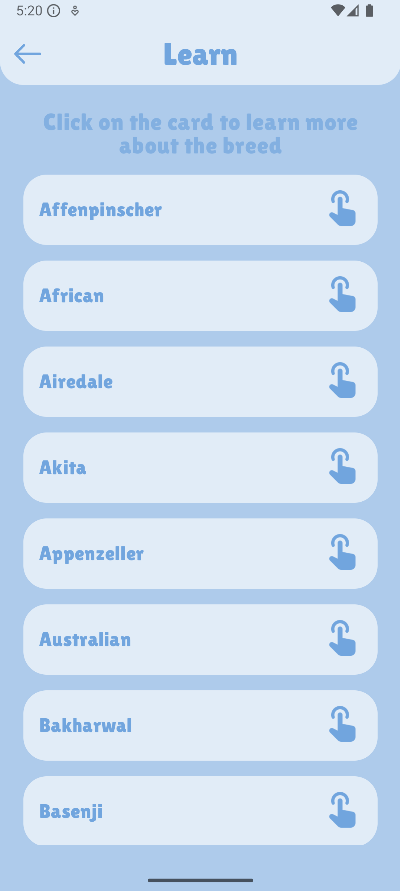
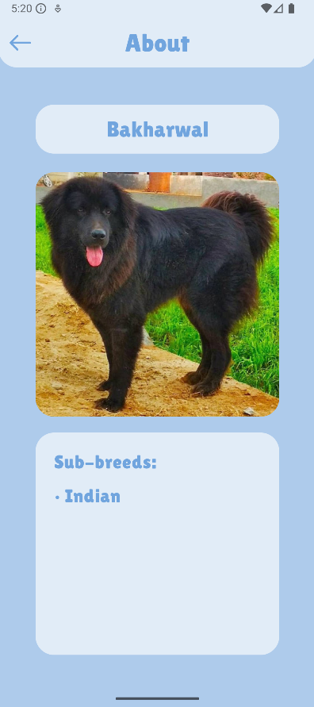
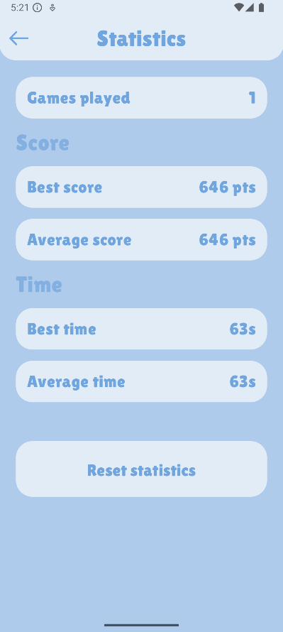

# 🐕 Pup Quiz

## Описание приложения
PupQuiz - мобильное приложение для изучения пород собак в игровой форме. Викторина с системой подсчета очков, таймером и статистикой. Использует Dog API для получения актуальных данных и изображений.

## Основной функционал
- **Интерактивная викторина**: 10 вопросов с фотографиями собак и вариантами ответов
- **Таймер и система очков**: Динамический подсчет очков (100 - 2×t секунд, минимум 50)
- **Статистика игр**: Отслеживание лучших и средних результатов, точности ответов
- **Экран со списком пород**: Список всех пород в API с фотографиями
- **Настройки**: Темная тема и управление звуковыми эффектами
- **Сохранение прогресса**: Продолжение игры с последнего вопроса после перезапуска

## Технологический стек
- Язык: **Kotlin**
- Архитектура: **Clean Architecture + MVVM**
- Асинхронность: **Kotlin Coroutines + Flow**
- DI: **Dagger Hilt**
- UI: **Jetpack Compose**
- Локальное хранилище: **Room + SharedPreferences**
- Сетевое взаимодействие: **Retrofit + Dog CEO API**
- Библиотеки: **Coil** (загрузка изображений), **Gson** (сериализация)

## Архитектура
#### Приложение построено по принципам Clean Architecture с четким разделением на слои:
- Data: Репозитории, API, локальное хранилище
- Domain: Use cases, модели, интерфейсы репозиториев
- Presentation: ViewModels, Composable экраны, навигация

## Скриншоты приложения

